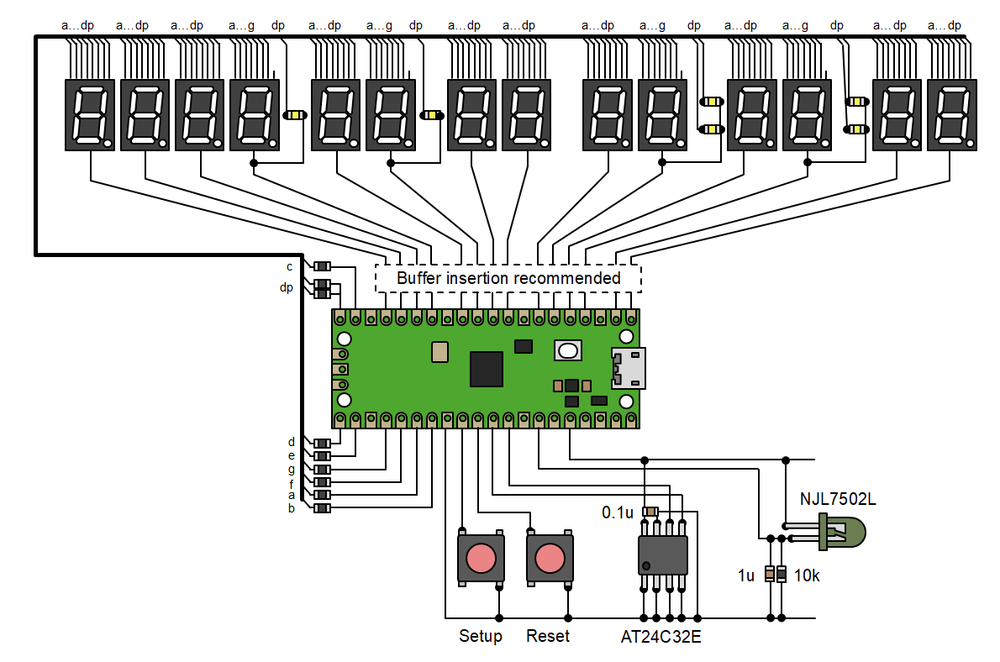

# NTP 7-segment Clock

NTP clock with 7-segment display.

## Parts

|Part|Type|
|:--|:--|
|MCU|RaspberryPi Pico2W|
|LED|SS512UWWB (Anode Common White LED)|
|EEPROM|[AT24C32E](https://akizukidenshi.com/catalog/g/g115715/)|
|Light Sensor|[NJL7502L](https://akizukidenshi.com/catalog/g/g102325/)|
|Switch|Tactile Switch (Active Low)|

## Connection

|Port|Connection|
|:--|:--|
|GP0|Digit\[0\]|
|GP1|Digit\[1\]|
|GP2|Digit\[2\]|
|GP3|Digit\[3\]|
|GP4|Digit\[4\]|
|GP5|Digit\[5\]|
|GP6|Digit\[6\]|
|GP7|Digit\[7\]|
|GP8|Digit\[8\]|
|GP9|Digit\[9\]|
|GP10|Digit\[10\]|
|GP11|Digit\[11\]|
|GP12|Digit\[12\]|
|GP13|Digit\[13\]|
|GP14|Segment 'c'|
|GP15|Segment 'dp'|
|GP16|Segment 'd'|
|GP17|Segment 'e'|
|GP18|Segment 'g'|
|GP19|Segment 'f'|
|GP20|Segment 'a'|
|GP21|Segment 'b'|
|GP22|Setup Switch|
|RUN|Reset Switch|
|GP26 (i2c1_sda)|EEPROM|
|GP27 (i2c1_scl)|EEPROM|
|GP28 (ADC3)|Light Sensor|

## Setup Page

[Setup Page](https://shapoco.github.io/vlconfig/#form:%7Bt:WiFi%20Setup,e:%5B%7Bk:c,t:t,l:Country,v:JP%7D,%7Bk:s,t:t,l:SSID%7D,%7Bk:p,t:p,l:Password%7D,%7Bk:n,t:t,l:NTP%20Server,v:ntp.nict.jp%7D,%7Bk:z,t:t,l:Time%20Offset,v:%220900%22%7D%5D%7D)
